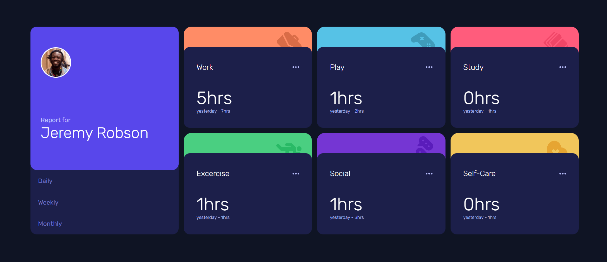
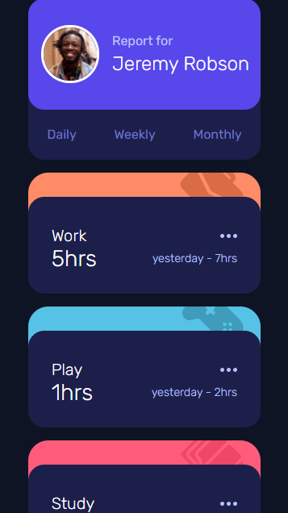

# time-tracking-dashboard

challenge from front end mentor. Time Tracking Dashboard.

link to project: https://naser23.github.io/time-tracking-dashboard/;

// SCREENSHOTS OF PROJECT //

// Desktop Version //

;

// Mobile Version //

;

// OVERVIEW //

I built this project with html/(scss/css)/js. this project pulls data from the json file and displays certain times onto the screen depending on the link you choose. Had some trouble creating the functionality for the links but I ended up creating three seperate functions for each of them. those functions did a fetch request and pulled the data for the specific time period that was selected.
